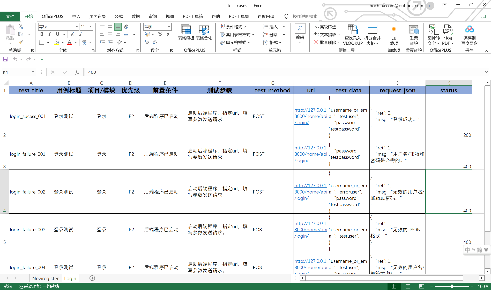
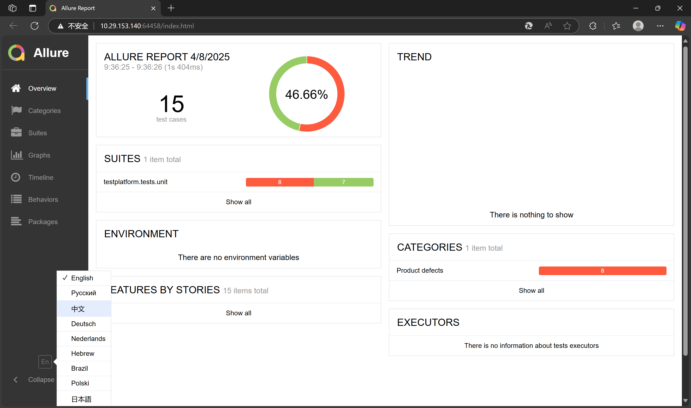

以下是针对你的自动化接口测试平台项目的README优化方案，结合项目特性与行业最佳实践：

---

### 一、项目标识与状态（置顶信息强化）
# AutoTest 自动化接口测试平台

[](https://www.python.org/)
[](https://www.djangoproject.com/)
[](LICENSE)

基于Django的REST API自动化测试框架，通过Excel数据驱动实现测试用例与测试代码的自动转换。

## 目录
- [核心功能](#核心功能)
- [配置说明](#配置说明)
- [快速开始](#快速开始)
- [测试用例管理](#测试用例管理)
- [项目结构](#项目结构)
- [贡献指南](#贡献指南)
- [许可协议](#许可协议)

## 核心功能

✅ **Excel数据驱动**  
通过结构化Excel模板管理测试用例，自动校验数据格式

✅ **测试代码生成**  
一键将Excel用例转换为符合unittest规范的测试代码

✅ **多维度验证**  
支持HTTP状态码和响应体双重断言

## 配置说明
项目配置在autotest/settings.py中，主要包括数据库配置、中间件、应用等
项目结构
```
autotest/
├── config/                 # Django配置
│   ├── settings.py        # 测试环境配置
│   └── urls.py            # API路由配置
├── function/              # 核心功能
│   └── excel_to_unittest/
│       └── generate_tests.py  # Excel转换引擎
├── testplatform/          # 测试平台
│   └── tests/
│       └── unit/          # 生成的测试用例
├── Exceldata/             # 测试用例存储目录
├── manage.py              # Django管理入口
└── pyproject.toml         # 依赖与打包配置
```

## 快速开始
### 环境要求
- Python 3.8+
- Django 4.2
- pandas
# 克隆仓库
git clone https://github.com/yujinandyanhaoyang/autotest_platform.git
cd autotest

# 安装依赖
pip install -r requirements.txt

# 初始化测试数据库
python manage.py migrate

## 测试用例管理
准备Excel文件 在项目根目录创建Exceldata目录，按以下格式编写测试用例
Excel文件格式规范：

| test_title       | test_method | url                              | test_data          | request_json                   | status |
|------------------|-------------|----------------------------------|--------------------|-------------------------------|--------|
| login_success    | post        | http://localhost:8000/api/login | {"username": ...} | {"ret":0, "msg":"成功"}      | 200    |URL_ADDRESS | {"username": ...} | {"ret":0, "msg":"成功"}      | 200    |
| login_failure    | post        | URL_ADDRESS| login_failure    | post        | http://localhost:8000/api/login | {"username":...} | {"ret":1, "msg":"失败"}      | 400    |
```
Exceldata/
├── test1cases.xlsx
└── test2cases.xlsx
```

## 生成测试代码
# 执行以下命令生成测试代码
python -m generate-tests --excel-dir Exceldata --output-dir testplatform/tests/unit

#运行测试套件
启动程序对当前所有的测试脚本程序进行测试
pytest --alluredir=./allure-results

使用命令启动allure查看测试报告
allure serve ./allure-results
测试报告样式


## 贡献指南
问题反馈 提交Issue时请提供：
测试用例Excel文件
生成的测试代码片段
错误日志截图
许可协议
本项目基于MIT许可证，详情见LICENSE文件。
